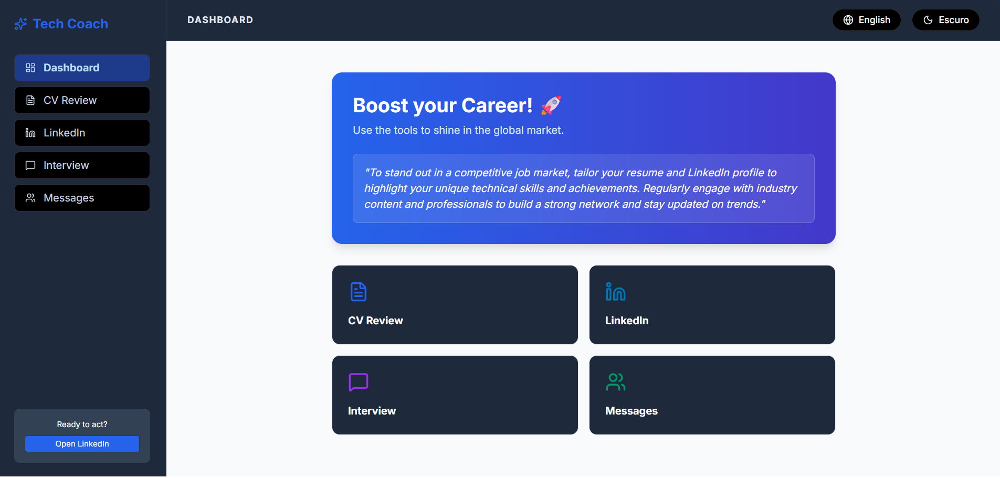

# 🚀 TechCareer Coach AI

An intelligent platform for **career mentorship in technology**, designed to help professionals stand out in the job market with practical tips, simulations, and personalized optimizations.

---

## 🎯 Features

- **CV Review**: Optimize resumes for ATS (HR filters).
- **LinkedIn Boost**: Improve personal branding to attract recruiters.
- **Interview Preparation**: Simulate real questions using the STAR method.
- **Strategic Networking**: Scripts and approaches that actually work.

---

## 🛠️ Tech Stack

- **React + Vite** for a fast and modern frontend.
- **TailwindCSS** for responsive styling.
- **OpenRouter API** for advanced AI model integration.
- **TypeScript** for safer and more productive coding.

---

## 💻 Running Locally

1. **Clone the repository**:
   ```bash
   git clone https://github.com/your-username/techcareer-coach-ai.git
   cd techcareer-coach-ai

# Install dependencies:

bash
npm install
Configure environment variables:
Create a .env.local file in the project root with your OpenRouter API key:

bash
npm run dev
Access the app at:
👉 http://localhost:3000

# 🌍 Deployment (Vercel / Netlify)
Push to GitHub:
The .gitignore file already protects your API key (ignores .env.local).

Configure environment variables on the server:

Go to Environment Variables in the Vercel/Netlify dashboard.

# Add:

Key: VITE_OPENROUTER_API_KEY

Value: your_api_key

Key: VITE_MODEL_ID

Value: mistralai/mistral-small-3.1-24b-instruct:free

Deployment will be automatic and your site will be live.

# 📌 Roadmap
[ ] Add multilingual support (PT/EN).

[ ] Implement automatic fallback between free models.

[ ] Improve UI with career progress dashboards.

[ ] Publish a mobile-friendly version.

🤝 Contributing
Contributions are welcome!
To collaborate:

# Fork the project.

Create a branch (git checkout -b feature/new-feature).

Commit your changes (git commit -m 'feat: add new feature').

Push (git push origin feature/new-feature).

Open a Pull Request.

# 📜 License
This project is licensed under the MIT License.
Copyright © 2026 Leandro Timóteo — Systems Analyst / Software Engineering

## 📬 Contact

- 📧 [Email](mailto:leandrinhots6@gmail.com)  
- 💼 [LinkedIn](https://www.linkedin.com/in/leandro-timóteo-ads)  
- 📱 [WhatsApp](https://wa.me/5583987830223)  
- 📷 [Instagram](https://www.instagram.com/leandrinho_fi)

## 📸 Screenshot




